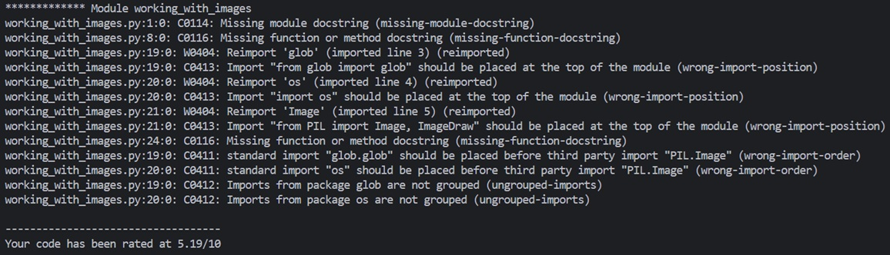
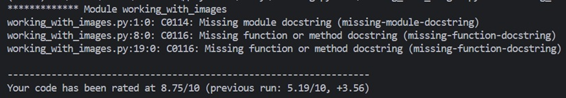
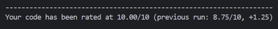

# Отчёт по заданию "Линтеры"
## Я скачал линтер pylint. Так как я и так использую линтер Ruff, то думал, что при проверке файлов через pylint ошибок быть не должно, но pylint выдал несоответствие правилам, проверка которых у меня в конфиге Ruff отключена. Также некоторые несоответсвтия были из-за того, что я оставлял импорты для каждого из подзаданий отдельно:

## Я решил исправить все недочёты, на которые указал линтер. После первой итерации, всё равно остались невыполненные правила:

## После второй итерации линтер показал, что всё отлично:

## Удобно, что линтер также показывает разницу в оценке между проверками.

## Основные правила, на которые указал линтер:
- C0114: Missing module docstring
- C0116: Missing function or method docstring
- W0404: Reimport
- C0413: Import should be placed at the top of the module
- C0411: standard import should be placed before third party import
- C0412: Imports from package are not grouped